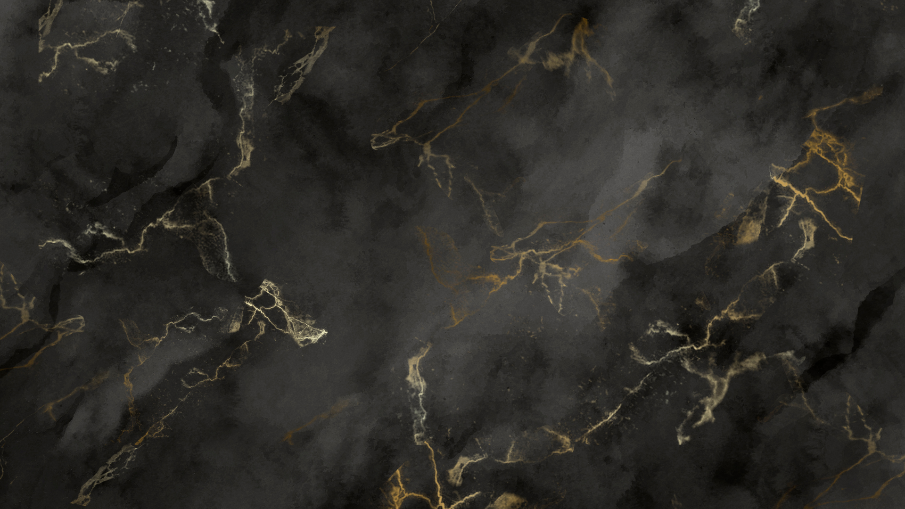

<!DOCTYPE html>
<html>
<head>
</head>
<body style="background-image: url('fondo.png'); background-size: cover; background-position: center; margin: 0; padding: 0;">
  

    

    <!-- Tus estadísticas y contenido adicional -->
    

      

        <h2><i class="fa-solid fa-code fa-xs" style="color: #25fb09;"></i> Programming language</h2>
        <!-- Código HTML de tus estadísticas y contenido -->
        
        

        <h3><i class="fa-solid fa-code fa-xs" style="color: #25fb09;"></i> Programming language</h3>
        
        
        
        

        <h3>Contact Me</h3>
        

        <h3>- FreeLance -</h3>
        

        
      

    

  

</body>
</html>

